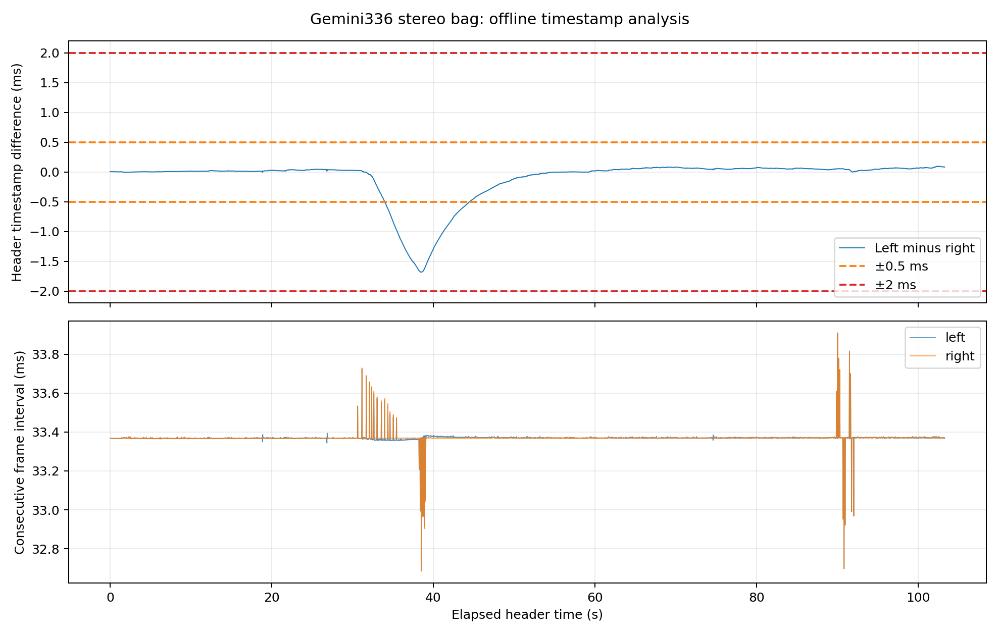

# Stereo timestamp 第一階段分析

日期：2026-09-17。資料：`bags/test_gemini336_stereo/test_gemini336_stereo_0.db3`。
本次只離線讀取 bag；未回放、未啟動 ROS／相機、未修改 SLAM 程式。

## 結論

- 不支持「左右時間差持續累積，直到尾端超標」的解釋。主要現象是中段相對
  timestamp 暫時偏移後恢復；不能僅憑 header 判定實際曝光同步或時鐘機制。
- 314 組超過 0.5 ms，集中在第 1,020～1,333 組；沒有任何一組超過 2 ms。
  數量與既有 0.5 ms 驗證紀錄一致，但離線對應不是 ApproximateTime 模擬，
  不能僅用本分析證明其每次 callback／丟棄行為。
- 最後左右影像均存在，差距 0.082 ms，在 0.5 ms 與 2 ms 容差內。
  尾端輸出缺口不能以 bag 尾端缺少單側影像或此對時間差超標解釋。
- 下一步需查同輪 subscriber、同步 callback、Frontend、TrackStereo 與匯出
  日誌，確認最後影像在哪一層停止；本階段尚未證明 ApproximateTime 是原因。

## 方法與限制

以唯讀 SQLite 讀取 CDR Image 的前 12 bytes，使用整數奈秒保留 header 精度。
支援傳統 CDR 大／小端，拒絕不支援的封裝與無效 nanosecond 欄位。
依 bag 儲存時間、message id 排列並保存原始儲存 timestamp，不先排序 sensor
timestamp；bag 儲存時間不當作感測或傳輸延遲。

先檢查各側連續性，再採用雙向最近鄰、距離嚴格小於半個正常幀週期的唯一對應。
搜尋半徑為 16.6845 ms，獨立於 0.5／2 ms 驗收容差。若有重複或倒退則停止
自動對應；未配對項目另列，不強迫匹配。此次全部 3,096 組一對一且同序號，
無未配對項目。此對應仍是時間戳推論，不是硬體曝光序號證明。

疑似缺口定義為間隔大於各側 median 的 1.5 倍；沒有觸發不等於已證明相機或
錄製系統絕對零掉幀。結果僅涵蓋此 bag 的記錄範圍。

## 單側連續性

| 項目 | 左 | 右 |
|---|---:|---:|
| 張數 | 3,096 | 3,096 |
| 重複／倒退 | 0／0 | 0／0 |
| 幀間隔 median | 33.369 ms | 33.369 ms |
| 幀間隔 P95 | 33.375 ms | 33.371 ms |
| 幀間隔 max | 33.909 ms | 33.907 ms |
| 超過 1.5 倍 median 的疑似缺口 | 0 | 0 |

## 左右時間差

符號定義：δ = 左 header − 右 header。P95 使用排序後的線性插值。

| 項目 | 結果 |
|---|---:|
| δ 最小／最大 | −1.683／+0.095 ms |
| 絕對時間差 median／P95 | 0.047／1.06825 ms |
| 超過 0.5 ms | 314 組 |
| 超過 2 ms | 0 組 |
| 超過 0.5 ms 的唯一連續區段 | 第 1,020～1,333 組 |
| 該區段相對時間 | 34.003195～44.445316 秒 |
| 首末超標樣本時間跨度 | 10.442121 秒 |
| 最大差距發生位置 | 第 1,154 組，38.473396 秒 |

10.442121 秒是首末超標樣本的距離，不是兩次有效 tracking 之間的中斷時間；
因此不直接替換先前日誌的約 10.51 秒 tracking 中斷紀錄。

5 秒分段 median 從 25～30 秒的 +0.035 ms，變為 35～40 秒的 −1.4235 ms，
再於 55～60 秒恢復到 −0.002 ms，100 秒後為 +0.071 ms。這支持暫時偏移並恢復，
而非全程單調累積。全段線性斜率約 +2,355.44 ns/s，會受到中段偏移影響，
不應把它直接解讀為兩側硬體時鐘頻率誤差；分段斜率見 CSV。



## 尾端

最後 20 組皆有唯一對應，差距為 0.082～0.093 ms。

| 最後第 3,096 組 | 結果 |
|---|---:|
| 左 header | 1789458677441121000 ns |
| 右 header | 1789458677441039000 ns |
| 左右差距 | +82,000 ns（0.082 ms） |
| 左／右前一幀間隔 | 33.368／33.370 ms |

這些是 bag 內資料證據，不能證明該次 node 已接收或處理最後一組。

## 產物與重現

- `summary.json`：統計、未配對與疑似缺口清單。
- `left_timestamps.csv`、`right_timestamps.csv`：逐張原始時間戳與幀間隔。
- `pairs.csv`：全部候選對應、帶符號差距、幀間隔及容差判定。
- `windows5s.csv`：每 5 秒統計與分段線性斜率。
- `threshold_segments.csv`：超標連續區段。
- `tail20.csv`：最後 20 張左影像的有效對應；本 bag 全部有對應。
- `timestamps.png`、`timestamps.svg`：可獨立使用的圖表。

在 workspace root 執行：

```bash
python3 scripts/analyze_stereo_timestamps.py \
  bags/test_gemini336_stereo/test_gemini336_stereo_0.db3 \
  results/stereo_timestamp_analysis

MPLCONFIGDIR=/tmp/gemini336-timestamp-matplotlib \
XDG_CACHE_HOME=/tmp/gemini336-timestamp-cache \
python3 scripts/plot_stereo_timestamps.py results/stereo_timestamp_analysis
```

分析程式只用 Python 標準函式庫。繪圖使用主機現有 matplotlib 3.10.8，未安裝
新依賴；它是離線報告工具，不是 ROS package 的 runtime／build 依賴。

## 驗證

已完成實際 bag 分析及 CSV 交叉檢查：3,096 組同序號對應、314 組超過 0.5 ms、
全部在 2 ms 內。另以合成 SQLite 資料驗證 CDR 大／小端解碼、整數奈秒精度及
無效 nanosecond 拒絕處理，皆通過。圖表由已輸出的 CSV 產生並完成目視檢查。
沒有進行實機或 SLAM runtime 驗證。
